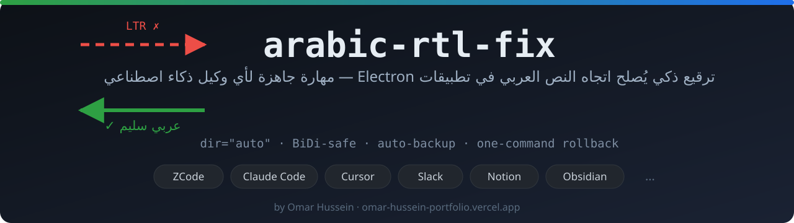
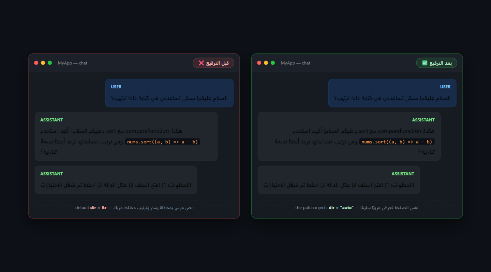
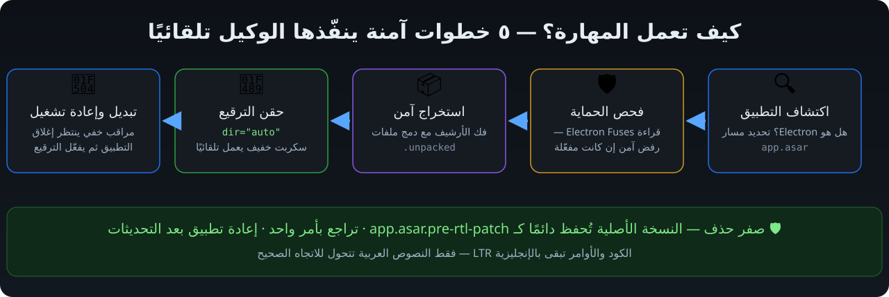

<p align="center">
  
</p>

<h3 align="center">ترقيع ذكي يُصلح اتجاه النص العربي في تطبيقات Electron<br/>مهارة (Skill) جاهزة ينفّذها أي وكيل ذكاء اصطناعي</h3>

<p align="center">
  <a href="LICENSE"></a>
  
  
  
</p>

<p align="center">
  🌐 <a href="https://omarhussien2.github.io/arabic-rtl-fix/"><b>معاينة لايف للديمو</b></a>
  ·
  ⬇️ <a href="https://github.com/Omarhussien2/arabic-rtl-fix/releases/latest"><b>حمّل آخر إصدار</b></a>
  ·
  🛒 <a href="https://www.agensi.io/skills/arabic-rtl-fix"><b>متوفرة على Agensi</b></a>
</p>

---

## 🔍 المشكلة

معظم تطبيقات سطح المكتب التقنية مبنية على **Chromium** لكنها تهمل اتجاه الكتابة العربية، فيظهر النص العربي **محاذى لليسار وبترتيب مختلط مربك** — خاصة عند خلط العربية مع مصطلحات إنجليزية وأكواد. جرب المستخدم العربي حلولًا كثيرة بلا فائدة، لأن العلة في خاصية `dir` داخل الواجهة نفسها.

<p align="center">
  
</p>

> نفس التطبيق، نفس الرسائل — الفرق الوحيد: حقنة `dir="auto"` واحدة تجعل أي عنصر يحتوي عربية يُعرض تلقائيًا من اليمين لليسار، بينما يبقى الكود والأوامر بالإنجليزية كما يجب.

## ⚙️ كيف تعمل؟

<p align="center">
  
</p>

الوكيل الذكي (ZCode، Claude Code، Cursor…) يقرأ التعليمات من `SKILL.md` وينفّذ الخطوات الخمس كاملة: يكتشف أن التطبيق Electron، يفحص إعدادات الحماية، يستخرج الأرشيف بأمان، يحقن السكربت، ثم يفعّل الترقيع — وينشئ لك سكربتات تراجع وإعادة تطبيق خاصة بجهازك.

## ✨ الميزات

- 🎯 **تلقائية بالكامل** — قل «العربي معكوس في تطبيق X، صلّحه» وسيُنفَّذ كل شيء
- 🛡️ **صفر مخاطر** — لا حذف أبدًا؛ النسخة الأصلية تُحفظ دائمًا، والتراجع بأمر واحد
- 🔬 **فحص حماية مسبق** — ترفض المهارة تلقائيًا ترقيع تطبيقات تفعّل حماية سلامة الأرشيف
- 🔄 **مقاومة التحديثات** — سكربت `reapply` يعيد الترقيع بعد أي تحديث للتطبيق
- 🖥️ **عبر المنصات** — Windows و macOS و Linux
- 🧩 **معيارية** — بنية Skills القياسية، تعمل مع أي وكيل يقرأ المهارات

## 📦 التثبيت

> 🆕 **المهارة منشورة الآن على منصة Agensi مجانًا:** [agensi.io/skills/arabic-rtl-fix](https://www.agensi.io/skills/arabic-rtl-fix)

**الطريقة 1 — بسطر واحد (المُوصى بها):**

```bash
npx skills add Omarhussien2/arabic-rtl-fix
```

**الطريقة 2 — استنساخ مباشر:**

```bash
git clone https://github.com/Omarhussien2/arabic-rtl-fix ~/.agents/skills/arabic-rtl-fix
```

**الطريقة 3 — مثبّت جاهز:** نزّل المستودع ثم شغّل `install.ps1` (ويندوز) أو `install.sh` (ماك/لينكس).

بعد التثبيت أعد تشغيل وكيلك، فقط.

## 🗣️ الاستخدام — قلها بأي صيغة

| ما تقوله لوكيلك | ما يحدث |
|---|---|
| «العربي بيطلع مقلوب في تطبيق X» | تُنفَّذ الخطوات الخمس كاملة مع تقرير مفصّل |
| «العربي مش مفهوم في التطبيق، صلّحه» | نفس الشيء — المهارة تتعرف على المشكلة تلقائيًا |
| *"Arabic shows left-to-right in my Slack — fix it"* | تعمل بالإنجليزية أيضًا |
| «أعد تطبيق ترقيع العربي» | بعد تحديث التطبيق الذي يمسح الترقيع |
| «ارجع بالنسخة الأصلية» | تراجع كامل بأمر واحد |

**متطلبات:** Node.js ‏16+ على جهازك، والتطبيق المستهدف يجب أن يكون مبنيًا على Electron بدون حماية asar integrity (المهارة تفحص ذلك وتُبلغك).

## 🧪 حالة الاختبار الموثّقة

- **Google Antigravity 2.21.1** على Windows 11: نجح الترقيع بسهولة تامة عبر حقن `preload.js` وتفعيل مراقب التبديل التلقائي (`watch-swap`)، وأصبحت كافة المحادثات وحقول الإدخال تدعم RTL بسلاسة.
- **ZCode Desktop v3.14.3** على Windows 10: الدردشة والمحرر والمعاينات وحقول الكتابة أصبحت تعرض العربية RTL سليمة، مع تراجع مُختبر، ومراقب تبديل تلقائي مُختبر، ومستخدم أكّد النتيجة. سجلات التحقق في الجلسة الأصلية.

## ⚠️ حدود معروفة (شفافية كاملة)

- **لوحات الطرفية** المبنية على xterm.js (مثل طرفية VS Code وتطبيقات AI CLI) لا تُصلح بهذه الطريقة — إنها مشكلة أعمق في محرك الطرفية؛ ملف `references/alternatives.md` يوثّق حلولها المناسبة
- بعض السطور شديدة الاختلاط (عربي + لاتيني في سطر واحد) قد تُرتَّب بترتيب Unicode البصري داخل عناصر معينة
- تطبيقات قليلة تفعّل حماية سلامة الأرشيف — المهارة تكتشفها وترفض الترقيع بأمان بدل تعطيل تطبيقك

## 📁 هيكل المستودع

```
arabic-rtl-fix/
├── SKILL.md                    ← دليل الوكيل الذكي (سير العمل الكامل)
├── assets/
│   └── rtl-snippet.html        ← حقنة dir="auto" (القلب النابض)
├── scripts/
│   ├── inject-rtl.mjs          ← حاقن HTML — idempotent ومجرب
│   ├── watch-swap.ps1          ← مراقب التبديل التلقائي
│   ├── rollback.ps1            ← التراجع للأصل
│   └── reapply.ps1             ← إعادة التطبيق بعد التحديثات
├── references/
│   ├── alternatives.md         ← حلول RTL للطرفيات وغير Electron
│   └── troubleshooting.md      ← استكشاف الأخطاء وإصلاحها
├── demo/demo.html              ← مصدر صورة قبل/بعد
├── docs/
│   ├── index.html              ← صفحة المعاينة اللايفة (GitHub Pages)
│   └── images/                 ← الصور التوضيحية
└── install.ps1 · install.sh    ← المثبّتات
```

## 🤝 المساهمة

وجدت تطبيقًا يحتاج معاملة خاصة؟ سطرًا لا يزال مقلوبًا؟ افتح [Issue](https://github.com/Omarhussien2/arabic-rtl-fix/issues) أو أرسل PR — خاصة نرحب باختبارات على macOS وLinux وتطبيقات إضافية.

## 👤 المؤلف

**Omar Hussein** — مطور ومهتم بتجربة المستخدم العربي في الأدوات التقنية

🌐 [الموقع والمعرض: omar-hussein-portfolio.vercel.app](https://omar-hussein-portfolio.vercel.app/)

---

## 🇬🇧 English Summary

**arabic-rtl-fix** is an AI-agent skill that repairs Arabic (and Hebrew/Persian/Urdu) text direction in Electron desktop apps. Chromium already shapes the letters — the breakage is direction: pages default to `dir=ltr`, so Arabic renders left-aligned with scrambled mixed lines. The skill guides any agent (Antigravity, ZCode, Claude Code, Cursor…) through a safe, verified procedure: detect Electron → check fuses → extract asar → inject a tiny `dir="auto"` snippet → swap with an auto-watcher that activates on app quit. Zero deletions, automatic backup, one-command rollback, re-apply script for post-update recovery. Verified end-to-end on **Google Antigravity** and **ZCode Desktop 3.14.3** (Windows). Terminal panels (xterm.js) are out of scope — see `references/alternatives.md`. MIT licensed.

🛒 **Also available on Agensi (free):** [agensi.io/skills/arabic-rtl-fix](https://www.agensi.io/skills/arabic-rtl-fix)

> صُنع بشغف من أجل مستخدم عربي أفضل 🌙
